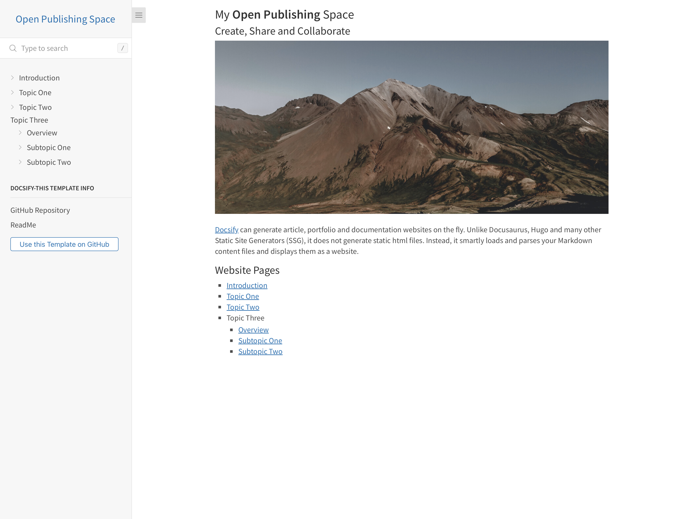

# Docsify-This Open Publishing Site Template

> This is an open publishing site template for use with [Docsify-This.net](https://docsify-this.net/#/).

_Figure 1. Docsify-This Open Pubilishing Site Template. Explore the resulting standalone web page generated by Docsify-This.net at [https://docsify-this.net/?basePath=https://raw.githubusercontent.com/paulhibbitts/docsify-this-multiple-page-open-publishing-site/main&homepage=home.md&sidebar=true&loadSidebar=_sidebar.md&searchbox=true&name=Open%20Publishing%20Space&hide-credits=true](https://docsify-this.net/?basePath=https://raw.githubusercontent.com/paulhibbitts/docsify-this-multiple-page-open-publishing-site/main&homepage=home.md&sidebar=true&loadSidebar=_sidebar.md&searchbox=true&name=Open%20Publishing%20Space&hide-credits=true)_

How to Use
---

1. Sign in to [GitHub](https://github.com), or create an account if you don’t already have one.

2. Tap **Use this template** in this repository (upper-right green button) and then choose **Create a new repository**

3. Choose the name for your new repository to contain the files and then tap **Create repository from template**

4. View an included Markdown file, for example **home.md**, and copy its URL.

5. Go to https://docsify-this.net and paste the copied URL into the **Markdown File URL** field

6. Select the page options you want (e.g. Docsify Sidebar) and tap the **Publish as a Web Page** button to view your Markdown file as a web page for sharing or embedding

> [!NOTE]
> For this template to work as designed, choose **Sidebar** for page layout and enable **Load a custom Docsify sidebar** in the **Advanced Web Page Builder Options** section. This will automatically load the custom navigation from `_sidebar.md` instead of manually adding URL parameters.

To edit a file in GitHub, tap the **Pencil icon** (Edit this file) in the upper-right when viewing the file, make your changes, and then tap the **Commit changes...** button to save those changes.  

To load the provided example [Docsify custom sidebar](https://docsify.js.org/#/more-pages?id=sidebar), manually add `&loadSidebar=_sidebar.md` to your published Docsify-This URL, for example:
https://docsify-this.net/?basePath=https://raw.githubusercontent.com/hibbitts-design/docsify-this-multiple-page-course-site/main&homepage=home.md&sidebar=true&loadSidebar=_sidebar.md

To load the provided example [Docsify custom sidebar](https://docsify.js.org/#/more-pages?id=sidebar) along with the [Docsify custom navbar](https://docsify.js.org/#/custom-navbar?id=custom-navbar), manually add `&loadSidebar=_sidebar.md&loadNavbar=_navbar.md` to your published Docsify-This URL, for example:
https://docsify-this.net/?basePath=https://raw.githubusercontent.com/paulhibbitts/docsify-this-multiple-page-open-publishing-site/main&homepage=home.md&sidebar=true&loadSidebar=_sidebar.md&loadNavbar=_navbar.md

The optional loading of a Docsify custom **Sidebar** and **Navbar** (equivalent to using the URL parameters `loadSidebar` and `loadNavbar`) is also available in the [Docsify-This Advanced Web Page Builder](https://docsify-this.net/?advanced=true).  

Using the ability to change the default values of the Docsify-This Web Page Builder, here are the needed **Sidebar** and **Searchbox** options already set - just replace the default Markdown file URL for **home.md** with your own! https://docsify-this.net/?advanced=true&url-field=https://github.com/hibbitts-design/docsify-this-multiple-page-open-publishing-site/blob/main/home.md&sidebar=true&loadSidebar=true&searchbox=true

Docsify-This Examples
---

Multiple Page Open Publishing Site [home.md](https://github.com/paulhibbitts/docsify-this-multiple-page-open-publishing-site/blob/main/home.md) file displayed by Docsify-This as: 
* [Standalone Site with Docsify Sidebar](https://docsify-this.net/?basePath=https://raw.githubusercontent.com/hibbitts-design/docsify-this-multiple-page-open-publishing-site/main&homepage=home.md&sidebar=true&loadSidebar=_sidebar.md&hide-credits=true "Docsify-This Multiple Page Open Publishing Site - Standalone Site with Docsify Sidebar")  
* [Standalone Site with Docsify Sidebar showing only H1 headers](https://docsify-this.net/?basePath=https://raw.githubusercontent.com/hibbitts-design/docsify-this-multiple-page-open-publishing-site/main&homepage=home.md&sidebar=true&loadSidebar=_sidebar.md&subMaxLevel=1&hide-credits=true "Docsify-This Multiple Page Open Publishing Site - Standalone Site with Docsify Sidebar only showing level 1 headers")  
* [Standalone Site with Docsify Sidebar and Search](https://docsify-this.net/?basePath=https://raw.githubusercontent.com/hibbitts-design/docsify-this-multiple-page-open-publishing-site/main&homepage=home.md&sidebar=true&loadSidebar=_sidebar.md&searchbox=true&hide-credits=true "Docsify-This Multiple Page Open Publishing Site - Standalone Site with Docsify Sidebar and Search")  
* [Standalone Site with Docsify Sidebar, Search and Website name](https://docsify-this.net/?basePath=https://raw.githubusercontent.com/hibbitts-design/docsify-this-multiple-page-open-publishing-site/main&homepage=home.md&sidebar=true&loadSidebar=_sidebar.md&searchbox=true&name=Open%20Publishing%20Space&hide-credits=true "Docsify-This Multiple Page Open Publishing Site - Standalone Site with Docsify Sidebar and Search")  
* [Standalone Site with Docsify Sidebar, Pagination buttons, Search and Website name](https://docsify-this.net/?basePath=https://raw.githubusercontent.com/hibbitts-design/docsify-this-multiple-page-open-publishing-site/main&homepage=home.md&sidebar=true&loadSidebar=_sidebar.md&pagination=true&searchbox=true&name=Open%20Publishing%20Space&hide-credits=true "Docsify-This Multiple Page Open Publishing Site - Standalone Site with Docsify Sidebar, Pagination buttons, Search and Website name")  
* [Standalone Site with Docsify Sidebar, Search, 'Propose an Edit to this Site' link and a Website name](https://docsify-this.net/?basePath=https://raw.githubusercontent.com/hibbitts-design/docsify-this-multiple-page-open-publishing-site/main&homepage=home.md&edit-link=https://github.com/hibbitts-design/docsify-this-multiple-page-open-publishing-site/blob/main&edit-link-text=Propose%20an%20Edit%20to%20this%20Site&sidebar=true&loadSidebar=_sidebar.md&searchbox=true&name=Open%20Publishing%20Space&hide-credits=true "Docsify-This Multiple Page Open Publishing Site - Standalone Site with Docsify Sidebar, 'Propose an Edit to this Site' link and a Website name")
* [Standalone Site with Docsify Sidebar, Search, 'Propose an Edit to this Site' link, Website name and a Coverpage](https://docsify-this.net/?basePath=https://raw.githubusercontent.com/hibbitts-design/docsify-this-multiple-page-open-publishing-site/main&homepage=home.md&edit-link=https://github.com/hibbitts-design/docsify-this-multiple-page-open-publishing-site/blob/main&edit-link-text=Propose%20an%20Edit%20to%20this%20Site&sidebar=true&loadSidebar=_sidebar.md&searchbox=true&coverpage=_coverpage.md&name=Open%20Publishing%20Space&hide-credits=true "Docsify-This Multiple Page Open Publishing Site - Standalone Site with Docsify Sidebar, 'Propose an Edit to this Site' link , Website name and a Coverpage")
